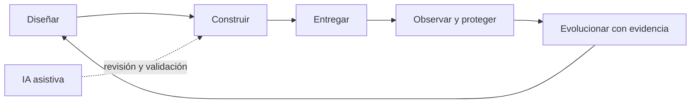

# Informática I: arquitectura de software moderna e IA

Curso práctico de la Especialización en Ingeniería de Software. El repositorio acompaña el libro **Arquitectura de Software Moderna y desarrollo asistido por inteligencia artificial** y convierte sus temas en rutas reproducibles de estudio, laboratorio y evaluación.

Preparado por los profesores:

- Dr. Carlos Montenegro Marin
- Dr. Esteban Hernández Barragán

## Propósito

El curso enseña a tomar decisiones arquitectónicas verificables, construir incrementos pequeños, entregar y operar software con herramientas libres, gestionar seguridad y utilizar IA generativa como colaborador no confiable. El caso conductor es **LibreReserva**, una API para reservar recursos institucionales.



## Ruta del curso

| # | Módulo | Laboratorio principal | Software |
|---:|---|---|---|
| 1 | [Entorno reproducible](modules/01_entorno/README.md) | Preparar y verificar estación | Git, Python, Make, Podman |
| 2 | [Atributos de calidad](modules/02_calidad/README.md) | Escenarios y funciones de aptitud | Jupyter, Python |
| 3 | [C4, UML y ADR](modules/03_c4_uml_adr/README.md) | Arquitectura como código | PlantUML, Graphviz |
| 4 | [Modularidad y dominio](modules/04_modularidad/README.md) | Núcleo hexagonal | Python, FastAPI |
| 5 | [Sistemas distribuidos](modules/05_distribucion/README.md) | Decidir antes de distribuir | Podman |
| 6 | [API, datos y eventos](modules/06_apis_datos_eventos/README.md) | Persistencia, idempotencia y outbox | PostgreSQL, RabbitMQ |
| 7 | [Implementación y pruebas](modules/07_pruebas/README.md) | Pirámide de pruebas y propiedades | pytest, Hypothesis |
| 8 | [Entrega y plataforma](modules/08_entrega_plataforma/README.md) | OCI, CI y Kubernetes local | Forgejo, Podman, kind |
| 9 | [Observabilidad](modules/09_observabilidad/README.md) | SLI/SLO y diagnóstico correlacionado | OpenTelemetry, Prometheus, Grafana, Jaeger |
| 10 | [Seguridad](modules/10_seguridad/README.md) | Amenazas y cadena de suministro | Gitleaks, Syft, Trivy, OWASP ZAP |
| 11 | [IA para desarrollo](modules/11_ia/README.md) | Evaluación controlada de asistencia | Ollama, Continue, Jupyter |
| 12 | [Proyecto integrador](modules/12_proyecto/README.md) | LibreReserva operable | Toda la plataforma |

## Inicio rápido

Los scripts son deliberadamente conservadores: muestran el plan por defecto y solo instalan paquetes cuando se usa `--apply`.

```bash
git clone https://github.com/eshernan/informatica-i-arquitectura-ia.git
cd informatica-i-arquitectura-ia

./scripts/check_environment.sh
./scripts/install_base.sh           # inspección, no modifica el sistema
./scripts/install_base.sh --apply   # instala después de revisar el plan
./scripts/setup_python.sh --apply

make test
make run
```

La API quedará en `http://127.0.0.1:8000` y su contrato interactivo en `http://127.0.0.1:8000/docs`.

### Sistemas compatibles

- GNU/Linux Debian/Ubuntu: ruta principal.
- macOS: Homebrew y máquina Linux de Podman.
- Windows: WSL2 con Debian/Ubuntu. Se recomienda guardar el repositorio dentro del sistema de archivos de WSL.

No ejecute un instalador con privilegios sin leerlo. Ningún script descarga y canaliza código remoto directamente a un intérprete.

## Libro y syllabus

- [Libro en PDF](docs/libro/Libro_Informatica_I_2026.pdf)
- [Fuentes LaTeX](docs/libro/latex/README.md)
- [Syllabus actualizado](docs/SYLLABUS.md) y [libro de Excel](docs/Syllabus_Informatica_I_Actualizado_2026.xlsx)
- [Agenda del segundo semestre de 2026 y distribución docente](docs/AGENDA_16_SEMANAS.md)
- Cada módulo enlaza las secciones del libro, objetivos, instalación, ejercicio, validación y evidencia esperada.

## Comandos comunes

```bash
make check       # entorno, sintaxis, notebooks y estructura
make test        # pruebas unitarias sin servicios externos
make test-all    # pruebas HTTP y propiedades; requiere make setup
make run         # API local; requiere el entorno Python
make notebooks   # inicia JupyterLab
```

## Política de IA

Se permite asistencia para análisis, código, pruebas, refactorización y documentación. Toda contribución debe declararse, revisarse, ejecutarse y comprenderse. No se ingresan secretos, datos personales ni código restringido en servicios no autorizados. El registro mínimo se encuentra en el módulo 11.

## Licencia

Código y material del repositorio se publican bajo la [licencia MIT](LICENSE), salvo componentes que declaren una licencia propia. Los modelos, imágenes de contenedor y dependencias conservan las licencias de sus respectivos proyectos.
