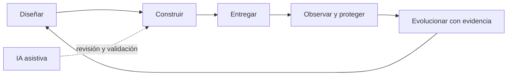

# Informática I: arquitectura de software moderna e IA

Curso práctico de la Especialización en Ingeniería de Software. El repositorio acompaña el libro **Arquitectura de Software Moderna y desarrollo asistido por inteligencia artificial** y convierte sus temas en rutas reproducibles de estudio, laboratorio y evaluación.

Preparado por los profesores:

- Dr. Carlos Montenegro Marín
- Dr. Esteban Hernández Barragán

## Propósito

El curso desarrolla los contenidos definidos para Informática I y los relaciona con prácticas contemporáneas de arquitectura y construcción de software. La agenda oficial prioriza la secuencia establecida por el profesor titular; los laboratorios reproducibles, la seguridad, la observabilidad y el uso responsable de IA se incorporan como apoyo o valor agregado, sin sustituir los temas del syllabus. El caso conductor es **LibreReserva**, una API para reservar recursos institucionales.



## Agenda oficial del curso

- Periodo: segundo semestre de 2026.
- Horario de los encuentros: miércoles de 6:00 p. m. a 10:00 p. m.
- Profesor titular: Dr. Carlos Montenegro Marín.
- Primer bloque: ocho sesiones a cargo del Dr. Carlos Montenegro Marín.
- Segundo bloque: ocho semanas académicas a cargo del Dr. Esteban Hernández Barragán.
- Caso conductor del segundo bloque: **LibreReserva**.

La secuencia conserva los contenidos definidos por el profesor titular. Los materiales adicionales del repositorio se relacionan con cada tema cuando aportan evidencia, práctica o actualización tecnológica.

### Unidad 1. Informática y conceptos básicos

| Semana | Fecha | Profesor | Tema |
|---:|---|---|---|
| 1 | 12 ago. | Carlos Montenegro | Modelo de software frente a arquitectura de software; evolución de las arquitecturas; cliente-servidor, multicapas y arquitectura web |
| 2 | 19 ago. | Carlos Montenegro | UML y su papel en el desarrollo de software; introducción al repositorio |
| 3 | 26 ago. | Carlos Montenegro | Paradigma de programación orientada a objetos; principios de POO y relación entre UML y POO |
| 4 | 2 sep. | Carlos Montenegro | Lenguajes modernos orientados a objetos: Python y Java |
| 5 | 9 sep. | Carlos Montenegro | Lenguajes modernos orientados a objetos: Python y Java |
| 6 | 16 sep. | Carlos Montenegro | Lenguajes modernos orientados a objetos: Python y Java |
| 7 | 23 sep. | Carlos Montenegro | Metapatrón MVC y manejo de comunicaciones |
| 8 | 30 sep. | Carlos Montenegro | Evaluación del primer bloque |

El miércoles 7 de octubre corresponde a la Semana Universitaria y no se programa una sesión ordinaria del curso.

### Unidad 2. Arquitectura de software

| Semana | Fecha | Profesor | Tema y práctica asociada |
|---:|---|---|---|
| 9 | 14 oct. | Esteban Hernández | Entorno reproducible: preparación y verificación de la estación de trabajo |
| 10 | 21 oct. | Esteban Hernández · virtual | Atributos de calidad: escenarios medibles y funciones de aptitud |
| 11 | 28 oct. | Esteban Hernández | Atributos de calidad aplicados a modularidad, dominio y núcleo hexagonal |
| 12 | 4 nov. | Esteban Hernández | Sistemas distribuidos: decidir antes de distribuir |
| 13 | 11 nov. | Esteban Hernández | API, datos y eventos: persistencia, idempotencia y patrón outbox |
| 14 | 18 nov. | Esteban Hernández | Implementación y pruebas; entrega y plataforma con OCI, CI y Kubernetes local |
| 15 | 25 nov. | Trabajo de proyecto | Jornada de trabajo autónomo; no hay encuentro sincrónico |
| 16 | 2 dic. | Esteban Hernández | Despliegue, demostración y cierre del proyecto |

La descripción institucional completa se encuentra en la [agenda del segundo semestre de 2026](docs/AGENDA_16_SEMANAS.md). Si existe una diferencia entre una guía de laboratorio y la agenda, prevalecen el syllabus y las orientaciones del profesor titular.

## Correspondencia entre la agenda y los materiales

| Semana | Material principal | Evidencia esperada | Software de apoyo |
|---:|---|---|---|
| 9 | [Entorno reproducible](modules/01_entorno/README.md) | Estación verificada y registro del entorno | Git, Python, Make, Podman |
| 10 | [Atributos de calidad](modules/02_calidad/README.md) | Escenarios con unidad, umbral y condiciones | Jupyter, Python |
| 11 | [Atributos de calidad](modules/02_calidad/README.md) y [modularidad y dominio](modules/04_modularidad/README.md) | Función de aptitud, límites y núcleo hexagonal | Python, FastAPI |
| 12 | [Sistemas distribuidos](modules/05_distribucion/README.md) | Matriz de decisión y experimento de fallo | Podman |
| 13 | [API, datos y eventos](modules/06_apis_datos_eventos/README.md) | Contrato, persistencia, prueba concurrente y evento | PostgreSQL, RabbitMQ |
| 14 | [Implementación y pruebas](modules/07_pruebas/README.md) y [entrega y plataforma](modules/08_entrega_plataforma/README.md) | Suite de pruebas, imagen OCI y despliegue local | pytest, Podman, Forgejo, kind |
| 15 | [Proyecto integrador](modules/12_proyecto/README.md) | Incremento autónomo y registro de decisiones pendientes | Herramientas seleccionadas por el equipo |
| 16 | [Entrega y plataforma](modules/08_entrega_plataforma/README.md) y [proyecto integrador](modules/12_proyecto/README.md) | Despliegue reproducible, demostración y paquete final | Podman, Kubernetes local |

### Material complementario y transversal

Estos módulos permanecen disponibles como apoyo. No crean sesiones adicionales ni reemplazan los temas de la agenda:

- [C4, UML y ADR](modules/03_c4_uml_adr/README.md): complementa UML y documenta decisiones arquitectónicas.
- [Observabilidad](modules/09_observabilidad/README.md): aporta evidencia operativa al despliegue y al proyecto.
- [Seguridad](modules/10_seguridad/README.md): integra amenazas, dependencias y cadena de suministro en API y entrega.
- [IA para desarrollo](modules/11_ia/README.md): apoya análisis, código, pruebas y documentación bajo revisión humana y trazabilidad.

El alcance evaluable de estos materiales será indicado por los profesores. Su uso debe reforzar los resultados del syllabus y no ampliar informalmente la carga del curso.

## Integración con AWS Academy

El curso utilizará **AWS Academy Learner Lab** para prácticas seleccionadas cuando el acceso institucional, los servicios y las cuotas hayan sido verificados. AWS complementa el caso LibreReserva y no sustituye la ruta reproducible con software libre.

- AWS Academy Cloud Foundations, o conocimientos equivalentes, se considera preparación previa.
- No se pretende completar dentro de Informática I un curso Associate de AWS Academy; Cloud Architecting, Cloud Developing y Cloud Operations tienen una duración aproximada de 40 horas cada uno.
- Learner Lab se emplea para asignaciones propias, despliegue controlado, observación de consumo y evidencia del proyecto.
- Cada práctica dependiente de AWS debe tener una alternativa local con las herramientas del repositorio.
- Los estudiantes deben eliminar los recursos al finalizar el laboratorio y no registrar credenciales ni secretos.
- La disponibilidad real de servicios se valida en el portal de AWS Academy antes de publicar cada ejercicio.

## Inicio rápido

Los scripts son deliberadamente conservadores: muestran el plan por defecto y solo instalan paquetes cuando se usa `--apply`.

```bash
git clone https://github.com/eshernan/informatica-i-arquitectura-ia.git
cd informatica-i-arquitectura-ia

./scripts/check_environment.sh
./scripts/install_base.sh           # inspección, no modifica el sistema
./scripts/install_base.sh --apply   # instala después de revisar el plan
./scripts/setup_python.sh --apply

make test
make run
```

La API quedará en `http://127.0.0.1:8000` y su contrato interactivo en `http://127.0.0.1:8000/docs`.

### Sistemas compatibles

- GNU/Linux Debian/Ubuntu: ruta principal.
- macOS: Homebrew y máquina Linux de Podman.
- Windows: WSL2 con Debian/Ubuntu. Se recomienda guardar el repositorio dentro del sistema de archivos de WSL.

No ejecute un instalador con privilegios sin leerlo. Ningún script descarga y canaliza código remoto directamente a un intérprete.

## Libro y syllabus

- [Libro en PDF](docs/libro/Libro_Informatica_I_2026.pdf)
- [Fuentes LaTeX](docs/libro/latex/README.md)
- [Syllabus actualizado](docs/SYLLABUS.md) y [libro de Excel](docs/Syllabus_Informatica_I_Actualizado_2026.xlsx)
- [Agenda del segundo semestre de 2026 y distribución docente](docs/AGENDA_16_SEMANAS.md)
- Cada módulo enlaza las secciones del libro, objetivos, instalación, ejercicio, validación y evidencia esperada.

## Comandos comunes

```bash
make check       # entorno, sintaxis, notebooks y estructura
make test        # pruebas unitarias sin servicios externos
make test-all    # pruebas HTTP y propiedades; requiere make setup
make run         # API local; requiere el entorno Python
make notebooks   # inicia JupyterLab
```

## Política de IA

Se permite asistencia para análisis, código, pruebas, refactorización y documentación. Toda contribución debe declararse, revisarse, ejecutarse y comprenderse. No se ingresan secretos, datos personales ni código restringido en servicios no autorizados. El registro mínimo se encuentra en el módulo 11.

## Licencia

Código y material del repositorio se publican bajo la [licencia MIT](LICENSE), salvo componentes que declaren una licencia propia. Los modelos, imágenes de contenedor y dependencias conservan las licencias de sus respectivos proyectos.
