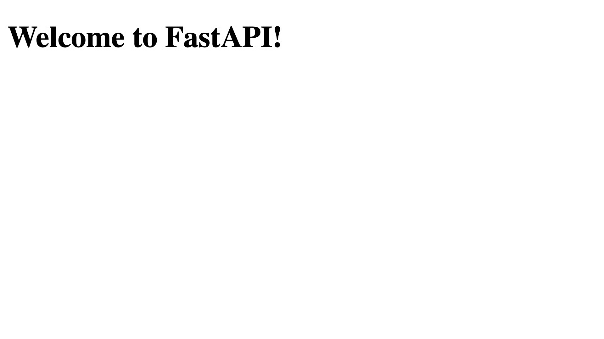
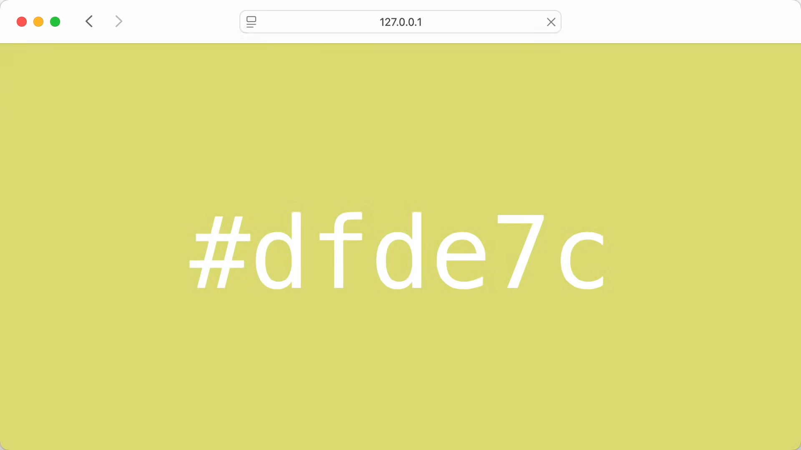
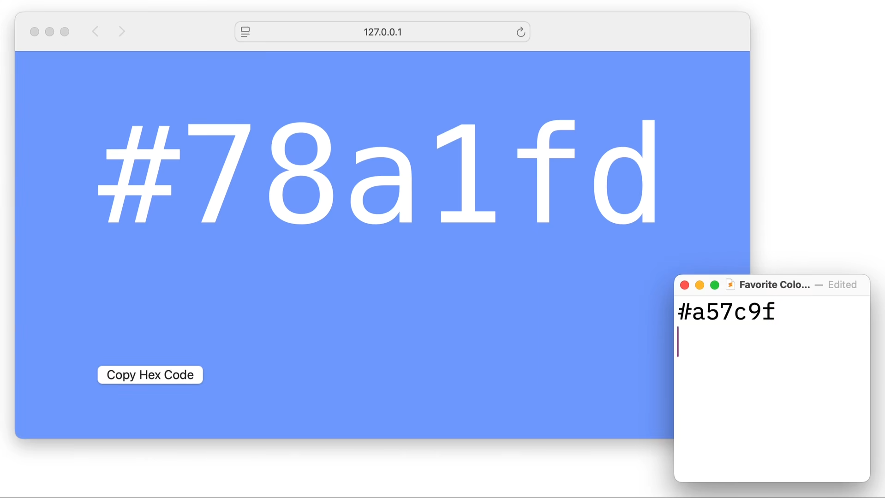
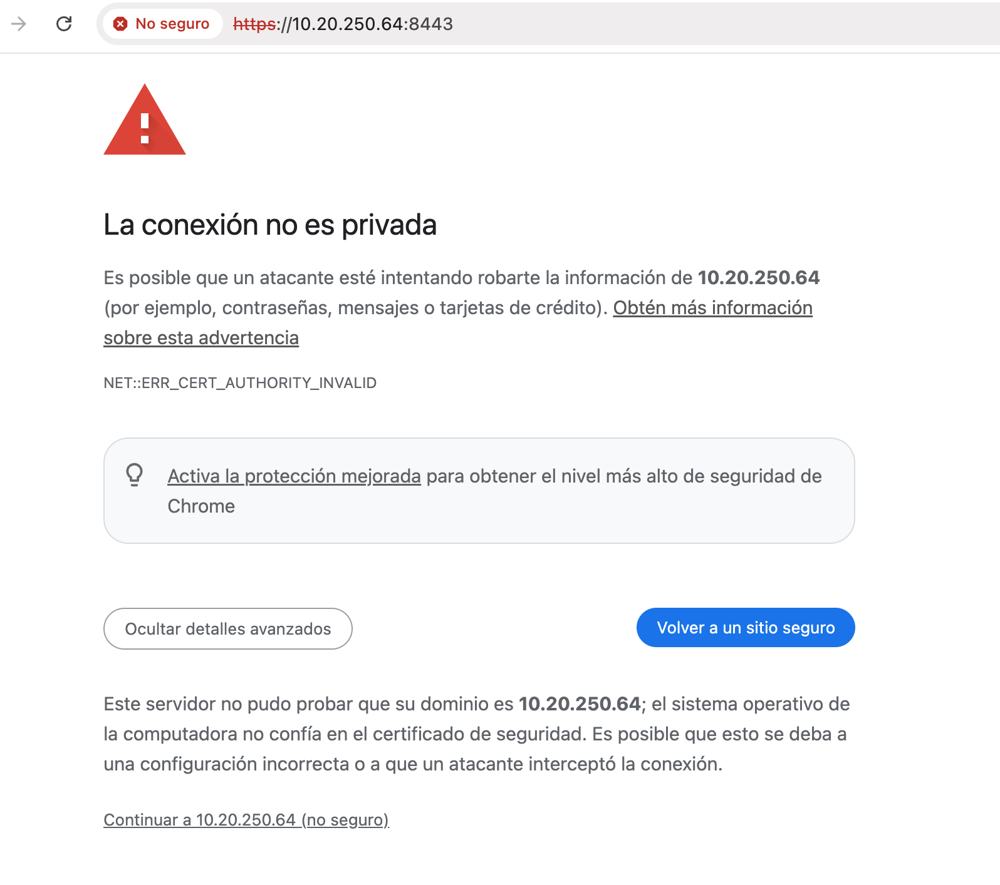
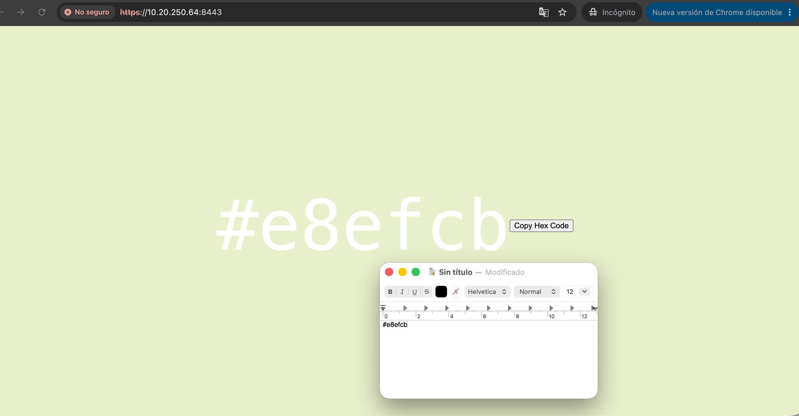
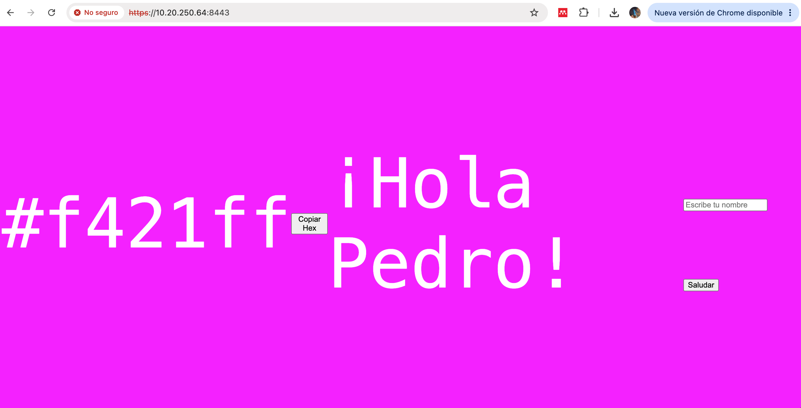
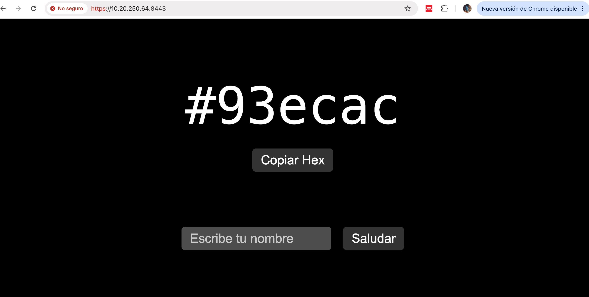

# Cómo Servir un Sitio Web con FastAPI Usando HTML y Jinja2

Al final de esta guía, podrás servir sitios web dinámicos desde endpoints de FastAPI utilizando plantillas Jinja2 con CSS y JavaScript. Aprovechando las clases `HTMLResponse`, `StaticFiles` y `Jinja2Templates` de FastAPI, usarás FastAPI como un framework web tradicional de Python.

Comenzarás devolviendo HTML básico desde tus endpoints, luego agregarás plantillas Jinja2 para contenido dinámico y, finalmente, crearás un sitio web completo con archivos CSS y JavaScript externos para copiar códigos de color hexadecimales.

Para continuar, debes sentirte cómodo con las funciones de Python y tener un conocimiento básico de HTML y CSS. La experiencia con FastAPI es útil, pero no es necesaria.

**Obtén tu código:** Haz clic aquí para descargar el código de muestra gratuito que muestra cómo servir un sitio web con FastAPI usando HTML y Jinja2.


## Prerrequisitos

Antes de comenzar a construir tu aplicación FastAPI que sirve HTML, necesitarás configurar tu entorno de desarrollo con los paquetes requeridos. Instalarás FastAPI junto con sus dependencias estándar, incluyendo el servidor ASGI que necesitas para ejecutar tu aplicación.

Selecciona tu sistema operativo a continuación e instala FastAPI con todas las dependencias estándar dentro de un entorno virtual:


**SO: Windows PowerShell**
```powershell
PS> python -m venv venv
PS> .\venv\Scripts\activate
(venv) PS> python -m pip install "fastapi[standard]"
```

**SO: Linux**
```Shell
$ python -m venv venv
$ source venv/bin/activate
(venv) $ python -m pip install "fastapi[standard]"
```

**SO: Linux en prod**
```Shell
sudo apt update
sudo apt install python3 python3-pip python3.10-venv
python3 -m venv venv
source venv/bin/activate
python -m pip install "fastapi[standard]"
sudo ufw allow 8000
```

Estos comandos crean y activan un entorno virtual , luego instalan FastAPI junto con Uvicorn como servidor ASGI y dependencias adicionales que mejoran la funcionalidad de FastAPI. Esta dopción standar garantiza que disponga de todo lo necesario para este tutorial, incluyendo Jinja2 para la creación de plantillas. 

## Paso 1: Devolver HTML básico a través de un punto final de API.

Si examinas detenidamente una aplicación de FastAPI , es común encontrar funciones que devuelven diccionarios , los cuales el framework serializa de forma transparente en respuestas JSON .

Sin embargo, la flexibilidad de FastAPI permite ofrecer diversas respuestas personalizadas además de esa; por ejemplo, HTMLResponse devuelve contenido como un text/html que el navegador interpreta como una página web.

Para explorar la devolución de HTML con FastAPI, cree un nuevo archivo llamado main.py y cree su primer endpoint que devuelva HTML:

```Python
from fastapi import FastAPI
from fastapi.responses import HTMLResponse

app = FastAPI()

@app.get("/", response_class=HTMLResponse)
def home():
    html_content = """
    <!DOCTYPE html>
    <html lang="en">
    <head>
        <meta charset="UTF-8">
        <title>Home</title>
    </head>
    <body>
        <h1>Welcome to FastAPI!</h1>
    </body>
    </html>
    """
    return html_content
```

Esta clase HTMLResponse  le indica a FastAPI que devuelva el contenido con el tipo text/html de contenido especificado en lugar de la respuesta application/json  predeterminada. Esto garantiza que los navegadores interpreten la respuesta como HTML en lugar de texto plano.

Antes de poder visitar su página de inicio, debe iniciar su servidor de desarrollo FastAPI para ver la respuesta HTML en funcionamiento:

En local
```Shell
(venv) $ fastapi dev main.py
```

En producción
```Shell
fastapi dev main.py --host 0.0.0.0 --port 8000
```


Visita la página http://127.0.0.1:8000/ o http://[Tu IP]:8000/ en tu navegador y verás el encabezado renderizado como HTML. El navegador muestra “Welcome to FastAPI!” como un elemento de encabezado propiamente dicho, no como texto sin formato con etiquetas HTML:



Si bien devolver cadenas HTML directamente desde los puntos finales es sencillo, tiene limitaciones. Reutilizar componentes HTML, gestionar diseños complejos y mantener la lógica de Python separada del marcado HTML se vuelve complicado. Precisamente para abordar estos desafíos se diseñaron las plantillas.

## Paso 2: Mejora tu aplicación FastAPI con plantillas Jinja2
La combinación de FastAPI y Jinja2 ofrece una potente forma de generar plantillas. Jinja2 permite separar la estructura HTML de la lógica Python, a la vez que proporciona funciones como la interpolación de variables y la herencia de plantillas.

Para crear un generador de colores aleatorios que demuestre cómo funcionan las plantillas Jinja2 con FastAPI, actualice la función home() en su archivo main.py:

```python
import random
from string import hexdigits

from fastapi import FastAPI
from fastapi.responses import HTMLResponse
from jinja2 import Template

app = FastAPI()

@app.get("/", response_class=HTMLResponse)
def home():
    hex_chars = "".join(random.choices(hexdigits.lower(), k=6))
    hex_color = f"#{hex_chars}"
    html_template = """
    <!DOCTYPE html>
    <html lang="en">
    <head>
        <meta charset="UTF-8">
        <title>Random Color Generator</title>
        <style>
            body {
                height: 100vh;
                display: flex;
                justify-content: center;
                align-items: center;
                background-color: {{ color }};
                color: white;
                font-size: 120px;
                font-family: monospace;
            }
        </style>
    </head>
    <body>
        <div id="color-code">{{ color }}</div>
    </body>
    </html>
    """

    html_content = Template(html_template)
    website = html_content.render(color=hex_color)

    return website
```

Dado que has instalado FastAPI con la opción standard, ya tienes el paquete jinja2 en tu proyecto. Para crear plantillas dinámicas en FastAPI, solo necesitas importar la clase Templatela de Jinja. Para devolver una respuesta HTML, importas HTMLResponse.

En la función home(), primero se crea un color hexadecimal utilizando seis dígitos aleatorios. A continuación, se inserta a través de html_content  el marcador de posición {{ color }}  antes de devolver la página web renderizada.

Ve a tu navegador, visita http://127.0.0.1:8000/ o http://[Tu IP]:8000/  y recarga la página varias veces para ver los diferentes colores aleatorios:



Si bien insertar plantillas strings HTML en tu código Python funciona para ejemplos sencillos, rápidamente se vuelve poco práctico para aplicaciones reales. En el siguiente paso, organizarás las plantillas y crearás una estructura de sitio web más completa.

## Paso 3: Sirva su sitio web con FastAPI.

Para crear un sitio web completo con FastAPI se requiere una estructura de proyecto adecuada que separe las plantillas Jinja, los archivos estáticos como los archivos CSS y JavaScript , y el código Python.

En este paso, crearás un generador de colores aleatorios más sofisticado que utiliza archivos de plantilla externos, hojas de estilo CSS y JavaScript para una funcionalidad mejorada. Este enfoque refleja la estructura de una aplicación web FastAPI en producción.

Primero, crea las carpetas templates/ y static/ dentro de tu proyecto junto al archivo existente main.py:

```Shell
(venv) $ mkdir templates static
```

Ahora, crea un nuevo archivo HTML llamado base.html en la carpeta templates/. Esta será tu plantilla Jinja principal que otras plantillas podrán extender:

```HTML
<!DOCTYPE html>
<html lang="en">
<head>
    <meta charset="UTF-8">
    <title>Random Color Generator</title>
    <link href="/static/style.css" rel="stylesheet">
</head>
<body>
    
    <script src="/static/script.js"></script>
</body>
</html>
```

Al igual que la plantilla HTML que serviste anteriormente, el archivo base.html contiene la estructura principal de tu sitio web. En lugar de agregar el estilo CSS a la plantilla, enlazas un archivo CSS externo en la línea 6. Además, conectas un archivo JavaScript externo a tu sitio web en la línea 10. Crearás ambos archivos en breve.

Ten en cuenta que en la línea 9 se utiliza la etiqueta  en lugar de añadir el elemento #color-code directamente. Esto define un bloque dinámico en la plantilla base, que la plantilla hija color.html reemplaza posteriormente con su propio bloque de congenido content.  

En tu carpeta templates/, junto a base.html, crea una nueva plantilla llamada color.html:

```HTML



    <style>
        body {
            background-color: {{ color }};
        }
    </style>
    <div id="color-code">{{ color }}</div>
    <button id="copy-button">Copy Hex Code</button>

```

Para conectar el archivo color.html con su plantilla base.html principal, debe agregar un etiqueta  en la parte superior del archivo. Luego, agregue estos tres elementos en el content del bloque:

1. Un bloque de style que establece la variable color proporcionada como el color de fondo del sitio web.

2. El elemento dive contiene el valor del color

3. Un botón que copia el valor hexadecimal al portapapeles.

El botón por sí solo no hace mucho. Para copiar el color hexadecimal al portapapeles al hacer clic en él, necesitarás un poco de JavaScript. Añade un archivo JavaScript con el siguiente contenido script.js en la carpeta static/

```JavaScript
document.querySelector('#copy-button').addEventListener('click', () => {
  const colorCode = document.querySelector('#color-code').textContent;
  navigator.clipboard.writeText(colorCode);
});
```
Con estas pocas líneas de JavaScript, añades un detector de eventos a copy-button tu sitio web. Cada vez que hagas clic en el botón, JavaScript copiará el código de color actual y lo guardará en el portapapeles.

Con el código HTML y la funcionalidad JavaScript ya implementados, es hora de añadir el estilo a tu sitio web. Crea static/style.css y añade el contenido que tenías en la etiqueta style al archivo, realizando un pequeño ajuste:

Nombre del archivo:

```CSS
body {
    height: 100vh;
    display: flex;
    justify-content: center;
    align-items: center;
    /* Remove: background-color: ; */
    color: white;
    font-size: 120px;
    font-family: monospace;
}
```

Al igual que antes, el estilo CSS garantiza que el código de color hexadecimal se muestre en el centro de la página con una fuente monoespaciada blanca y grande. Dado que el color de fondo se define dinámicamente en la plantilla color.html, debe eliminar la declaración background-color.

Ya has enlazado style.css y script.js en tu archivo base.html. Por lo tanto, el único ajuste que queda es adaptar tu aplicación FastAPI para conectar todas las piezas. Actualiza tu main.py para usar los archivos de plantilla y servir contenido estático:

```Python
import random
from string import hexdigits

from fastapi import FastAPI, Request
from fastapi.responses import HTMLResponse
from fastapi.staticfiles import StaticFiles
from fastapi.templating import Jinja2Templates

app = FastAPI()

app.mount("/static", StaticFiles(directory="static"), name="static")
templates = Jinja2Templates(directory="templates")

@app.get("/", response_class=HTMLResponse)
def home(request: Request):
    hex_chars = "".join(random.choices(hexdigits.lower(), k=6))
    hex_color = f"#{hex_chars}"
    context = {
        "color": hex_color,
    }
    return templates.TemplateResponse(
        request=request, name="color.html", context=context
    )
```

Dado que no estás renderizando la plantilla en la función home(), puedes eliminar la importación Template anterior de jinja2. En su lugar, dependerás completamente de las clases que proporciona FastAPI.

La Clase Jinja2Templates carga las plantillas desde tu directorio templates/, a la vez que StaticFiles sirve tus archivos CSS y JavaScript. El método templates.TemplateResponse() combina tu plantilla con los datos de contexto para generar el HTML final. Observa cómo pasas el objeto request a cada respuesta de plantilla, lo cual requiere FastAPI  para un correcto procesamiento de las solicitudes.

Ejecuta tu aplicación y visita la página http://127.0.0.1:8000/ o http://[Tu IP]:8000/ para ver tu sitio web alojado en FastAPI en funcionamiento:


El sitio web dinámico que has creado contiene la estructura base que puedes ampliar fácilmente. Puedes añadir más plantillas y crear componentes de plantilla reutilizables. Si deseas alojar otro sitio, puedes definir puntos de acceso adicionales, utilizando las opciones y parámetros que ofrece FastAPI.

Muy probablemente si estas corriendo tu app desde un entorno diferente a localhost, el botón copiar no funciona, esto se debe a que la función de JavaScript navigator.clipboard.writeText, es deshabilitada en los navegadores modernos para ambientes no seguros (no https).

## Paso 4: Desplegar en un sitio seguro con HTTPS.

Ahora vamos a hacer que Nuestro sitio sea seguro para que funcione el botón copiar con la función de JavaScript navigator.clipboard.writeText.

Para ello lo primero que vamos a hacer es generar nuestros certificados locales en el servidor. En la misma carpeta en donde este em main.py ejecutar:

```Bash
openssl genrsa -out key.pem 2048
openssl req -new -x509 -key key.pem -out cert.pem -days 365
```
LLena todos los datos y cuando te pida el Common Name, escribe localhost (o 127.0.0.1). Así el certificado será válido para pruebas locales.

(Opcional) Si quieres evitar la advertencia del navegador, instala y usa mkcert; los archivos generados tendrán nombres distintos, solo ajusta las rutas en el código.

Ahora agrega al final de tu main.py el llamado al servidor web de uvicorn agregando los certificados.

```python
from fastapi.responses import HTMLResponse
from fastapi.staticfiles import StaticFiles
from fastapi.templating import Jinja2Templates

app = FastAPI()

app.mount("/static", StaticFiles(directory="static"), name="static")
templates = Jinja2Templates(directory="templates")

@app.get("/", response_class=HTMLResponse)
def home(request: Request):
    hex_chars = "".join(random.choices(hexdigits.lower(), k=6))
    hex_color = f"#{hex_chars}"
    context = {
        "color": hex_color,
    }
    return templates.TemplateResponse(
        request=request, name="color.html", context=context
    )

if __name__ == "__main__":
    import uvicorn

    uvicorn.run(
        "main3:app",
        host="0.0.0.0",           # Escucha en todas las interfaces (para pruebas)
        port=8443,                # Puerto para HTTPS (puedes cambiarlo)
        ssl_keyfile="key.pem",    # Ruta a tu clave privada
        ssl_certfile="cert.pem",  # Ruta a tu certificado
    )
```

Por último, cambia la forma de lanzar el servidor, ya no es necesario hacerlo con  fastapi dev main.py --host 0.0.0.0 --port 8000, porque el main.py tiene el llamado al servidor uvicorn, ahora solo basta con ejecutar el main con Python.

```Bash
python3 main.py
```
Debes tener en cuenta que hemos cambiado el puerto, ahora debes consultarlo desde el puerto 8443 y a través  del protocolo https con https://127.0.0.1:8443/ o https://[Tu IP]:8443/





## Paso 5: Metodos para una Api.

Los Métodos HTTP para tu API nson 
GET: Lee o recupera información de un recurso. No debe modificar la base de datos.
POST: Crea un recurso nuevo enviando los datos en el cuerpo de la petición.
PUT: Reemplaza un recurso existente por completo con la nueva información enviada.
PATCH: Modifica parcialmente un recurso existente actualizando solo los campos especificados.
DELETE: Elimina de forma permanente un recurso específico del servidor.

Ya hemos visto GET, ahora vamos a ver POST, para ello vamos a agregar a la aplicación un boton que se llame saludar y una caja de texto, de tal forma que el usuario pueda escribir su nombre en la caja de texto, y al dar en el boton enviar el programa emita un mensaje que salude a la persona.

Añadiremos una ruta POST am main.py para procesar el nombre

```Python
import random
from string import hexdigits
from fastapi import FastAPI, Request, Form          # ← importamos Form
from fastapi.responses import HTMLResponse
from fastapi.staticfiles import StaticFiles
from fastapi.templating import Jinja2Templates

app = FastAPI()
app.mount("/static", StaticFiles(directory="static"), name="static")
templates = Jinja2Templates(directory="templates")


@app.get("/", response_class=HTMLResponse)
def home(request: Request):
    hex_chars = "".join(random.choices(hexdigits.lower(), k=6))
    hex_color = f"#{hex_chars}"
    context = {
        "color": hex_color,
        "saludo": None,          # ← sin saludo en GET
    }
    return templates.TemplateResponse(
        request=request, name="color.html", context=context
    )


@app.post("/", response_class=HTMLResponse)   # ← nueva ruta POST
def saludar(request: Request, nombre: str = Form(...)):
    hex_chars = "".join(random.choices(hexdigits.lower(), k=6))
    hex_color = f"#{hex_chars}"
    saludo = f"¡Hola {nombre}!"                # ← saludo personalizado
    context = {
        "color": hex_color,
        "saludo": saludo,
    }
    return templates.TemplateResponse(
        request=request, name="color.html", context=context
    )


if __name__ == "__main__":
    import uvicorn
    uvicorn.run(
        "main:app",
        host="0.0.0.0",
        port=8443,
        ssl_keyfile="key.pem",   # si usas HTTPS
        ssl_certfile="cert.pem"
    )
```
  Añadimos el formulario y mostramos el saludo en color.html

  ```html
  


    <style>
        body {
            background-color: {{ color }};
        }
    </style>
    <div id="color-code">{{ color }}</div>
    <button id="copy-button">Copiar Hex</button>

    
        <div id="saludo">{{ saludo }}</div>
    

    <form action="/" method="post">
        <input type="text" name="nombre" placeholder="Escribe tu nombre" required>
        <button type="submit">Saludar</button>
    </form>

```

Ajustamos estilos para que todo se vea bien en style.css

```CSS
body {
    height: 100vh;
    display: flex;
    flex-direction: column;
    justify-content: center;
    align-items: center;
    color: white;
    font-family: monospace;
}

#color-code {
    font-size: 120px;
    margin-bottom: 20px;
}

button, input {
    font-size: 30px;
    padding: 10px 20px;
    margin: 10px;
    border-radius: 8px;
    border: none;
}

#saludo {
    font-size: 60px;
    margin: 20px;
}
```
Ahora vamos a probar el funcionamiento

```bash
bash
python main.py
```

Abre tu navegador en https://127.0.0.1:8443 o https://[Tu IP]:8443/. Verás un color aleatorio. Escribe tu nombre en el campo y pulsa Saludar.

La página recargará con un nuevo color y mostrará el mensaje, por ejemplo: ¡Hola Pedro!

El botón Copiar Hex seguirá funcionando correctamente.



Como el formulario usa POST, los datos del nombre viajan en el cuerpo de la petición. Si usas HTTPS (con los certificados que generaste), la comunicación es segura.

## Paso 6: Usando el API Creada y probandola con PostMan

Finalmente vamos a hacer una API completo de la ampliación y a consumirla, que tenga sus métodos GET y POST, al estructira debe quedar así:
```
/
├── main.py
├── static/
│   ├── script.js
│   └── style.css
└── templates/
    ├── base.html
    └── color.html
```

Modificamos el main.py (Backend API) y debe quedar así:

```python
import random
from string import hexdigits
from fastapi import FastAPI, Request, HTTPException
from fastapi.responses import HTMLResponse, JSONResponse
from fastapi.staticfiles import StaticFiles
from fastapi.templating import Jinja2Templates
from pydantic import BaseModel

app = FastAPI()

app.mount("/static", StaticFiles(directory="static"), name="static")
templates = Jinja2Templates(directory="templates")


def generar_color():
    """Genera un color hexadecimal aleatorio."""
    hex_chars = "".join(random.choices(hexdigits.lower(), k=6))
    return f"#{hex_chars}"


# --- Modelo para el cuerpo de la petición POST ---
class NombreRequest(BaseModel):
    nombre: str


# --- Endpoints de la API ---

@app.get("/", response_class=HTMLResponse)
def home(request: Request):
    """Sirve la página HTML con un color inicial."""
    color = generar_color()
    return templates.TemplateResponse(
        request=request, name="color.html", context={"color": color}
    )

@app.get("/color", response_class=JSONResponse)
def get_color():
    """Endpoint público para obtener un color aleatorio en JSON."""
    return {"color": generar_color()}


@app.post("/saludar", response_class=JSONResponse)
def saludar(data: NombreRequest):
    """
    Recibe un nombre y devuelve un saludo personalizado junto con un nuevo color.
    """
    nombre = data.nombre.strip()
    if not nombre:
        raise HTTPException(status_code=400, detail="El nombre no puede estar vacío")
    
    saludo = f"¡Hola {nombre}!"
    nuevo_color = generar_color()
    return {"saludo": saludo, "color": nuevo_color}

if __name__ == "__main__":
    import uvicorn
    uvicorn.run(
        "main:app",
        host="0.0.0.0",
        port=8443,
        ssl_keyfile="key.pem",   # si usas HTTPS
        ssl_certfile="cert.pem"
    )
```

Luego los HTML (Frontend) templates/color.html (sin formulario POST) y quedan así:

```HTML



    <div id="color-code">{{ color }}</div>
    <button id="copy-button">Copiar Hex</button>
    <div id="saludo"></div>
    <div>
        <input type="text" id="nombre-input" placeholder="Escribe tu nombre" required>
        <button id="saludar-button">Saludar</button>
    </div>

```
Interacción con la API mediante fetch,  significa usar la función nativa fetch() de JavaScript para enviar peticiones HTTP a un servidor y recibir o enviar datos (como JSON) de forma asíncrona, sin recargar la página, para ello modificamos static/script.js

```JavaScript
document.addEventListener('DOMContentLoaded', function() {
    // Referencias a elementos del DOM
    const colorCodeEl = document.getElementById('color-code');
    const saludoEl = document.getElementById('saludo');
    const copyBtn = document.getElementById('copy-button');
    const nombreInput = document.getElementById('nombre-input');
    const saludarBtn = document.getElementById('saludar-button');

    // --- Función para actualizar el color en la página ---
    function actualizarColor(color) {
        document.body.style.backgroundColor = color;
        colorCodeEl.textContent = color;
    }

    // --- Copiar al portapapeles con fallback (para HTTP) ---
    async function copiarTexto(texto) {
        try {
            await navigator.clipboard.writeText(texto);
            console.log('Copiado con clipboard API');
            return true;
        } catch (err) {
            console.warn('Clipboard API falló, usando fallback', err);
            // Fallback con execCommand
            const temp = document.createElement('input');
            temp.value = texto;
            document.body.appendChild(temp);
            temp.select();
            temp.setSelectionRange(0, 99999);
            try {
                const success = document.execCommand('copy');
                document.body.removeChild(temp);
                return success;
            } catch (e) {
                document.body.removeChild(temp);
                return false;
            }
        }
    }

    // --- Evento para copiar el color ---
    copyBtn.addEventListener('click', async function() {
        const color = colorCodeEl.textContent;
        const ok = await copiarTexto(color);
        if (ok) {
            copyBtn.textContent = '¡Copiado!';
            setTimeout(() => { copyBtn.textContent = 'Copiar Hex'; }, 2000);
        } else {
            alert('No se pudo copiar el código');
        }
    });

    // --- Evento para saludar (llamada POST a la API) ---
    saludarBtn.addEventListener('click', async function() {
        const nombre = nombreInput.value.trim();
        if (nombre === '') {
            alert('Por favor, escribe un nombre');
            return;
        }

        try {
            const response = await fetch('/saludar', {
                method: 'POST',
                headers: {
                    'Content-Type': 'application/json'
                },
                body: JSON.stringify({ nombre: nombre })
            });

            if (!response.ok) {
                const errorData = await response.json();
                throw new Error(errorData.detail || 'Error al saludar');
            }

            const data = await response.json();
            // Actualizar saludo y color con los datos recibidos
            saludoEl.textContent = data.saludo;
            actualizarColor(data.color);
            nombreInput.value = ''; // limpiar campo

        } catch (error) {
            console.error('Error:', error);
            alert('Hubo un error: ' + error.message);
        }
    });

    // --- Opcional: enviar al presionar Enter en el input ---
    nombreInput.addEventListener('keypress', function(e) {
        if (e.key === 'Enter') {
            saludarBtn.click();
        }
    });
});
```
Por ultimo se mejoran los Estilos para una experiencia limpia en static/style.css

```CSS
body {
    height: 100vh;
    display: flex;
    flex-direction: column;
    justify-content: center;
    align-items: center;
    color: white;
    font-family: monospace;
    transition: background-color 0.3s ease;
    background-color: black;
}

#color-code {
    font-size: 120px;
    margin-bottom: 20px;
}

#saludo {
    font-size: 60px;
    margin: 20px;
    min-height: 70px; /* para evitar saltos al aparecer */
}

button, input {
    font-size: 30px;
    padding: 10px 20px;
    margin: 10px;
    border-radius: 8px;
    border: none;
}

button {
    background-color: rgba(255,255,255,0.2);
    color: white;
    cursor: pointer;
}

button:hover {
    background-color: rgba(255,255,255,0.4);
}

input {
    background-color: rgba(255,255,255,0.3);
    color: white;
}

input::placeholder {
    color: rgba(255,255,255,0.7);
}
```

Ahora vamos a probar el funcionamiento

```bash
bash
python main.py
```

Abre tu navegador en https://127.0.0.1:8443 o https://[Tu IP]:8443/. Ahora puedes cosnumier los servicios que ofrece la API.



Y tambien puedes probar los EndPoints con Postman (https://www.postman.com/) los end point son:

GET
https://[Tu IP]:8443/
Regresa el html de la pagina inicial.
```HTML
<!DOCTYPE html>
<html lang="en">

<head>
    <meta charset="UTF-8">
    <title>Random Color Generator</title>
    <link href="/static/style5.css" rel="stylesheet">
</head>

<body>

    <div id="color-code">#bf5a70</div>
    <button id="copy-button">Copiar Hex</button>
    <div id="saludo"></div>
    <div>
        <input type="text" id="nombre-input" placeholder="Escribe tu nombre" required>
        <button id="saludar-button">Saludar</button>
    </div>

    <script src="/static/script5.js"></script>
</body>

</html>
```

GET
https://[Tu IP]:8443/color
Regresa el color generado en foramto JSON
```JSON
{
    "color": "#b84da7"
}
```

POST
https://[Tu IP]:8443/saludar
Se le envia en el Body, como formato JSON el nombre de la persona
```JSON
{"nombre": "Ana"}
```
y regresa el saludo en formato JSON
```JSON
{
    "saludo": "¡Hola Ana!",
    "color": "#a1347a"
}
```


